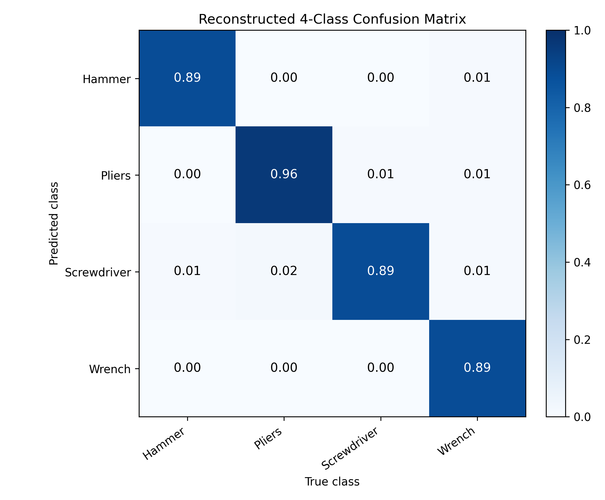

# YOLO11m 4-Class Operating Report

## 1. 목적

본 보고서는 이미 학습이 완료된 YOLO11m 모델 산출물을 바탕으로, 실제 운영 대상을 다음 4개 클래스로 제한해 재구성한 분석 보고서이다.

| 운영 클래스 | 클래스 매핑 |
|---|---|
| Hammer | `Hammer` |
| Pliers | `Pliers`, `plier` |
| Screwdriver | `Screwdriver` |
| Wrench | `Wrench` |

운영 기준은 추론 결과 중 위 4개 클래스만 사용하는 방식으로 정의한다. 특히 `Pliers`와 `plier`는 의미상 같은 물체로 보고 하나의 `Pliers` 운영 클래스로 통합한다.

## 2. 사용 권장 가중치

| 항목 | 경로 |
|---|---|
| 권장 가중치 | `runs/yolov11_report/tools_report/weights/best.pt` |
| 최종 가중치 | `runs/yolov11_report/tools_report/weights/last.pt` |

전체 학습 결과에서 최고 성능은 124 epoch에서 기록되었다. 따라서 운영 기준 모델은 `last.pt`보다 `best.pt`가 적절하다.

| 지표 | 최고값 | epoch |
|---|---:|---:|
| mAP50 | 0.86456 | 124 |
| mAP50-95 | 0.69299 | 124 |
| Precision | 0.88118 | 67 |
| Recall | 0.83828 | 105 |

이 수치는 전체 클래스 기준의 평균 성능이다. 다만 운영 대상 4개 클래스는 데이터 수가 많은 편이므로, 전체 평균보다 안정적으로 동작할 가능성이 높다. 반대로 `Hardhat`, `Toolbox`, `Drill`처럼 데이터가 적거나 운영 대상이 아닌 클래스는 실제 운영에서 제외한다.

## 3. 4개 운영 클래스 데이터 분포

| 운영 클래스 | Train annotations | Val annotations | Total annotations |
|---|---:|---:|---:|
| Hammer | 1,778 | 322 | 2,100 |
| Pliers | 1,706 | 455 | 2,161 |
| Screwdriver | 1,473 | 351 | 1,824 |
| Wrench | 1,592 | 362 | 1,954 |
| 합계 | 6,549 | 1,490 | 8,039 |

4개 운영 클래스는 전체 annotation 9,578개 중 8,039개를 차지한다. 비율로는 약 83.9%이다. 즉 데이터셋의 대부분이 실제 운영 대상 클래스에 해당하므로, 4개 클래스 운영 관점의 보고서로 재구성하는 것은 타당하다.

클래스별 데이터 수도 비교적 균형적이다. 가장 많은 `Pliers`는 2,161개, 가장 적은 `Screwdriver`는 1,824개로, 네 클래스 사이의 annotation 수 차이가 크지 않다. 기존 전체 클래스 보고서에서 문제가 되었던 `Hardhat` 1개, `Toolbox` 83개, `Drill` 104개 같은 극단적인 소수 클래스 문제는 4클래스 운영 범위에서는 제외된다.

`labels.jpg`는 전체 데이터셋의 annotation 분포를 보여준다. 운영 대상 4개 클래스는 데이터셋의 중심을 이루는 다수 클래스이므로, 실제 사용 시 성능을 가장 기대할 수 있는 클래스들이다.

## 4. 학습 곡선 해석

### 4.1 전체 학습 결과

전체 학습 결과는 정상적인 수렴 형태를 보인다. 학습 초반에는 loss가 빠르게 감소하고 precision, recall, mAP가 급격히 상승한다. 이후 100 epoch 전후부터 성능 증가 폭이 줄어들며 안정화된다.

4개 운영 클래스 관점에서 중요한 점은 후반부에 성능이 붕괴하지 않았다는 것이다. 모델은 마지막까지 안정적으로 유지되었고, 최고 mAP는 124 epoch에서 기록되었다. 따라서 4개 클래스 운영에서도 `best.pt`를 기준으로 사용하는 것이 적절하다.

### 4.2 Train loss

Train loss는 `box_loss`, `cls_loss`, `dfl_loss` 모두 꾸준히 감소했다. 이는 모델이 학습 데이터에서 객체 위치, 클래스 구분, bounding box 경계 추정을 점진적으로 개선했다는 의미이다.

4개 운영 클래스는 데이터가 충분한 편이므로, train loss 하락의 주된 기여 클래스일 가능성이 높다. 특히 `Hammer`, `Pliers`, `Screwdriver`, `Wrench`는 annotation 수가 많고 검증셋에도 충분히 포함되어 있어 모델이 반복적으로 패턴을 학습할 수 있었다.

### 4.3 Validation loss

Validation loss도 전반적으로 감소했다. 이는 학습 데이터에만 맞춰진 과적합보다는 검증 데이터에서도 성능이 개선되었음을 보여준다. 4개 운영 클래스는 검증 annotation도 총 1,490개로 충분하므로, validation loss 해석의 신뢰도가 높다.

단, validation loss가 계속 낮아진다고 해서 운영 성능이 항상 최고가 되는 것은 아니다. 실제 최고 mAP는 124 epoch에서 기록되었고, 이후 마지막 epoch까지는 거의 안정화 상태에 들어갔다. 따라서 운영에서는 마지막 epoch 기준이 아니라 mAP 최고점 기준의 `best.pt`를 선택해야 한다.

### 4.4 mAP

mAP50은 0.86456, mAP50-95는 0.69299까지 상승했다. mAP50은 객체를 대략적으로 잘 찾는지를 보여주고, mAP50-95는 더 엄격한 위치 정확도까지 반영한다.

4개 운영 클래스는 형태가 서로 비슷한 공구들이다. 특히 `Screwdriver`, `Wrench`, `Pliers`는 길고 얇거나 금속 질감이 유사해 bounding box 경계와 클래스 구분이 함께 어려워질 수 있다. 따라서 mAP50은 높지만 mAP50-95가 상대적으로 낮은 것은, 객체 존재 여부는 잘 찾지만 box 위치를 매우 엄격하게 맞추는 데는 개선 여지가 있다는 의미로 해석할 수 있다.

### 4.5 Precision / Recall

Precision과 recall은 모두 0.8 이상 수준으로 안정화되었다. 이는 운영 대상 공구를 찾을 때 오검출과 미검출이 모두 과도하지 않은 균형 상태라는 의미이다.

운영 목적에 따라 threshold 설정은 달라져야 한다.

| 운영 목표 | 권장 방향 |
|---|---|
| 놓치는 객체를 줄이고 싶을 때 | confidence threshold를 낮춰 recall 우선 |
| 오검출을 줄이고 싶을 때 | confidence threshold를 높여 precision 우선 |
| 일반적인 자동 인식 | F1 curve 기준 threshold 선택 |

## 5. 4개 클래스 기준 Confusion Matrix

위 행렬은 원본 normalized confusion matrix에서 운영 대상 클래스만 추출하고, `Pliers`와 `plier`를 하나의 `Pliers` 클래스로 통합해 재구성한 것이다. 행은 예측 클래스, 열은 실제 클래스를 의미한다.

| Predicted \ True | Hammer | Pliers | Screwdriver | Wrench |
|---|---:|---:|---:|---:|
| Hammer | 0.89 | 0.00 | 0.00 | 0.01 |
| Pliers | 0.00 | 0.96 | 0.01 | 0.01 |
| Screwdriver | 0.01 | 0.02 | 0.89 | 0.01 |
| Wrench | 0.00 | 0.00 | 0.00 | 0.89 |

| 운영 클래스 | 관찰된 경향 |
|---|---|
| Hammer | 대각선 값이 약 0.89로 양호하다. 일부 background 또는 유사 공구와의 혼동이 있으나 주요 클래스 중 안정적인 편이다. |
| Pliers | 통합 기준 대각선 값이 약 0.96으로 가장 높다. `Pliers`와 `plier`를 하나의 운영 클래스로 합치면 실제 사용성이 좋아진다. |
| Screwdriver | 대각선 값이 약 0.89로 양호하지만, 일부 background 혼동이 보인다. 길고 얇은 물체 특성상 작은 객체나 겹침 상황에서 누락 가능성이 있다. |
| Wrench | 대각선 값이 약 0.89로 양호하다. 공구류 중에서도 비교적 안정적으로 분류되는 편이다. |

재구성된 4클래스 행렬에서는 네 클래스 모두 대각선 값이 0.89 이상이다. 이는 운영 대상 클래스 사이의 직접적인 혼동이 크지 않다는 의미이다. 특히 `Pliers`는 두 라벨을 통합했을 때 약 0.96으로 가장 안정적이다.

## 6. 추론 결과 필터링 정책

현재 모델은 아래 기존 클래스 ID를 출력한다.

| 기존 ID | 기존 클래스명 | 운영 처리 |
|---:|---|---|
| 4 | Hammer | 유지 |
| 7 | Pliers | `Pliers`로 통합 |
| 8 | Screwdriver | 유지 |
| 10 | Wrench | 유지 |
| 11 | plier | `Pliers`로 통합 |
| 기타 | Tools, 0, 1, Drill, Hardhat, Measuring Tape, Toolbox | 무시 |

운영 단계에서는 다음 정책을 적용한다.

1. 모델 추론 결과 중 class id가 `4`, `7`, `8`, `10`, `11`인 detection만 남긴다.
2. class id `7`과 `11`은 모두 `Pliers`로 표시한다.
3. 그 외 클래스는 화면 표시, 저장, 통계 집계에서 제외한다.
4. 기본 모델은 `best.pt`를 사용한다.
5. threshold는 목적에 따라 조정하되, 초기값은 confidence 0.25, IoU 0.7 근처에서 시작한다.

이 정책을 적용하면 화면 표시, 저장 결과, 통계 집계가 모두 4개 운영 클래스로 정리된다.

## 7. Validation 예측 이미지 활용

Validation 예측 이미지는 4개 운영 클래스만 눈으로 확인할 때 특히 중요하다. 평가할 때는 다음 항목을 중심으로 보면 된다.

1. `Hammer`, `Pliers`, `Screwdriver`, `Wrench`가 실제로 존재할 때 누락되는지 확인한다.
2. `Pliers`와 `plier`가 서로 다르게 표시되더라도 운영상 하나의 `Pliers`로 합쳐 해석한다.
3. `Drill`, `Toolbox`, `Measuring Tape` 등 운영 제외 클래스가 검출되더라도 최종 출력에서는 무시한다.
4. 작은 screwdriver나 겹친 wrench처럼 box가 흔들릴 수 있는 사례를 별도로 확인한다.

## 8. 결론

최종 운영 대상은 `Hammer`, `Pliers`, `Screwdriver`, `Wrench` 네 클래스이다. 이 네 클래스는 전체 annotation의 약 83.9%를 차지하고, 각 클래스의 학습/검증 데이터도 충분한 편이다.

운영 관점의 핵심은 `Pliers`와 `plier`를 하나로 합치고, 나머지 클래스 출력은 무시하는 것이다. 이렇게 하면 실제 필요한 공구 4종 탐지에 집중할 수 있다.

최종 권장 구성은 다음과 같다.

| 항목 | 권장값 |
|---|---|
| weight | `runs/yolov11_report/tools_report/weights/best.pt` |
| 사용 클래스 ID | `4`, `7`, `8`, `10`, `11` |
| 표시 클래스 | `Hammer`, `Pliers`, `Screwdriver`, `Wrench` |
| 통합 규칙 | `Pliers` + `plier` -> `Pliers` |
| 제외 클래스 | `Tools`, `0`, `1`, `Drill`, `Hardhat`, `Measuring Tape`, `Toolbox` |
