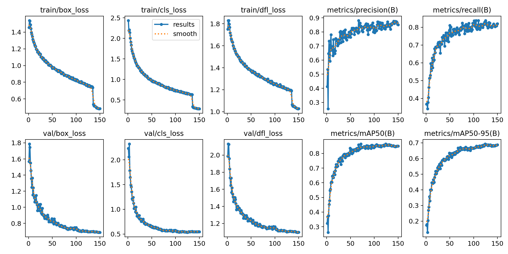
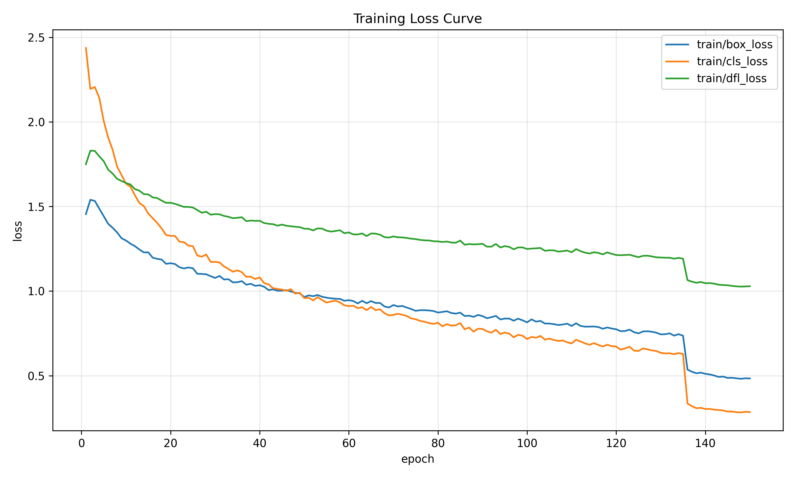
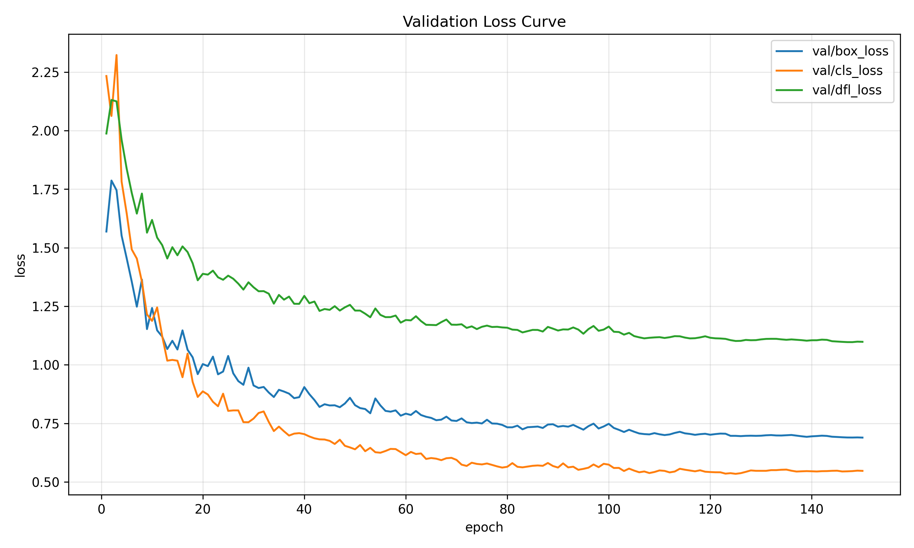
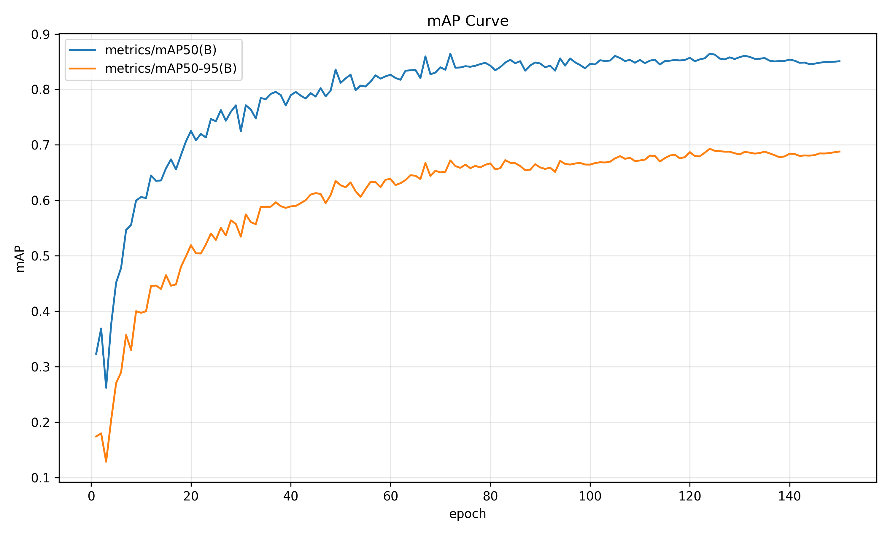
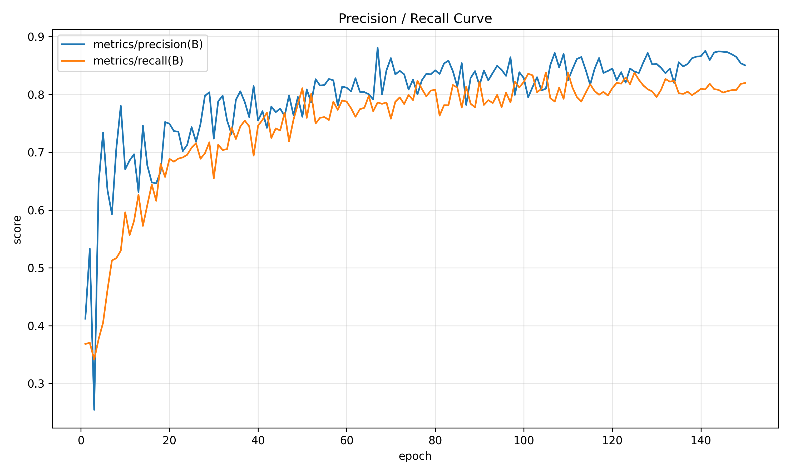
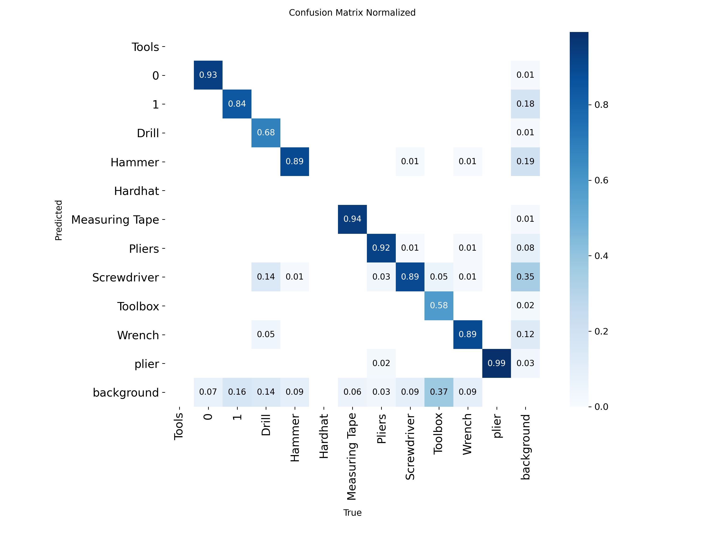
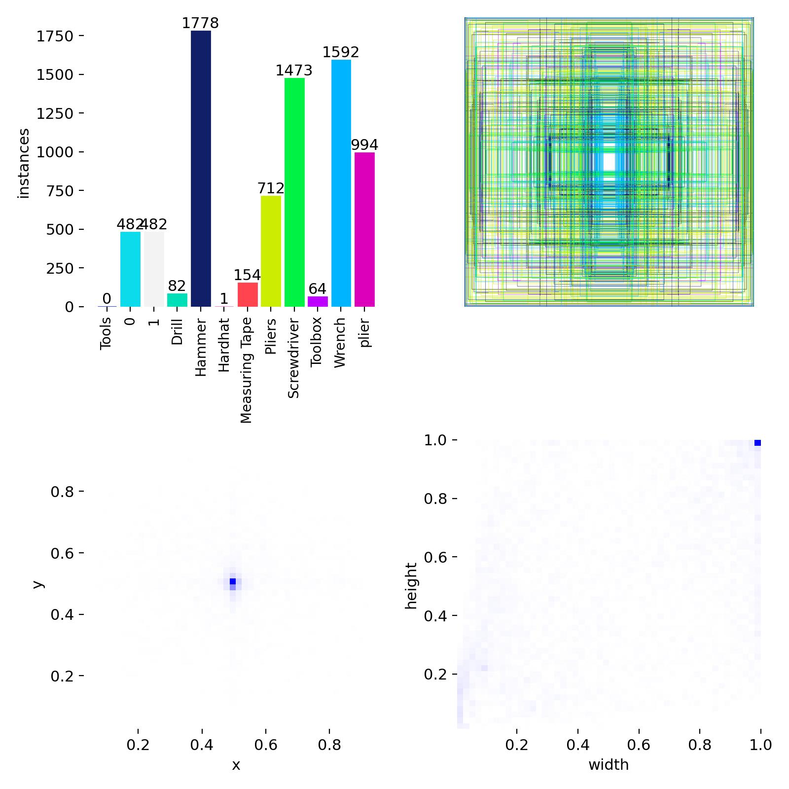

# CV Project #3 YOLO11m 학습 결과 보고서

## 1. 실험 개요

본 실험은 공구 및 안전 장비 객체 탐지를 목표로 YOLO11m 모델을 도메인 데이터셋에 fine-tuning한 결과를 분석한다. 학습은 총 150 epoch 동안 수행되었으며, 검증 성능 기준 최고 성능은 124 epoch에서 기록되었다.

학습 결과는 `report_yolo11m` 및 `runs/yolov11_report/tools_report` 디렉터리에 저장되어 있으며, 주요 산출물은 학습 로그 CSV, 손실/성능 그래프, confusion matrix, validation batch 예측 이미지이다.

## 2. 데이터셋 구성

| 항목 | 값 |
|---|---:|
| 전체 이미지 수 | 5,204 |
| 학습 이미지 수 | 4,163 |
| 검증 이미지 수 | 1,041 |
| 전체 annotation 수 | 9,578 |
| 클래스 수 | 12 |

클래스 목록은 다음과 같다.

| ID | 클래스명 | annotation 수 |
|---:|---|---:|
| 0 | Tools | 0 |
| 1 | 0 | 600 |
| 2 | 1 | 562 |
| 3 | Drill | 104 |
| 4 | Hammer | 2,100 |
| 5 | Hardhat | 1 |
| 6 | Measuring Tape | 189 |
| 7 | Pliers | 900 |
| 8 | Screwdriver | 1,824 |
| 9 | Toolbox | 83 |
| 10 | Wrench | 1,954 |
| 11 | plier | 1,261 |

데이터셋은 클래스별 annotation 수 차이가 매우 크다. `Hammer`, `Screwdriver`, `Wrench`, `plier` 클래스는 비교적 많은 반면, `Hardhat`은 1개, `Toolbox`는 83개, `Drill`은 104개에 그친다. 또한 `Pliers`와 `plier`가 별도 클래스로 분리되어 있고, 클래스명이 `0`, `1`인 항목이 존재한다. 이는 학습 성능 해석과 실제 배포 시 클래스 매핑에 혼동을 줄 수 있으므로 후처리 또는 데이터셋 재정리가 필요하다.

## 3. 학습 설정

| 항목 | 설정 |
|---|---|
| 모델 | YOLO11m |
| epoch | 150 |
| batch size | 16 |
| image size | 640 |
| optimizer | auto |
| 초기 learning rate | 0.0005 |
| weight decay | 0.0005 |
| patience | 35 |
| device | GPU 0 |
| augmentation | mosaic 1.0, mixup 0.15, copy_paste 0.15 |
| freeze | 3 |
| AMP | enabled |

학습에는 비교적 강한 augmentation이 적용되었다. Mosaic, mixup, copy-paste는 객체 탐지 모델의 일반화 성능을 높이는 데 도움이 되지만, 클래스 수가 적거나 annotation이 매우 부족한 클래스에서는 데이터 품질 문제를 완전히 보완하기 어렵다.

## 4. 주요 성능 결과

| 지표 | 최고값 | 기록 epoch |
|---|---:|---:|
| Precision | 0.88118 | 67 |
| Recall | 0.83828 | 105 |
| mAP50 | 0.86456 | 124 |
| mAP50-95 | 0.69299 | 124 |

최고 mAP50-95는 124 epoch에서 0.69299로 기록되었다. 같은 epoch의 주요 지표는 다음과 같다.

| 지표 | 값 |
|---|---:|
| Precision | 0.84497 |
| Recall | 0.81787 |
| mAP50 | 0.86456 |
| mAP50-95 | 0.69299 |
| train box loss | 0.75705 |
| train cls loss | 0.64794 |
| train dfl loss | 1.20727 |
| val box loss | 0.69665 |
| val cls loss | 0.53718 |
| val dfl loss | 1.10519 |

mAP50 기준으로는 0.86456까지 도달하여 객체 위치를 대략적으로 맞추는 성능은 양호하다. mAP50-95는 0.69299로, 더 엄격한 IoU 기준에서도 일정 수준 이상의 localization 성능을 확보했다. Precision 최고값은 recall 최고값보다 빠른 67 epoch에서 나왔으며, 이후 recall과 mAP가 더 개선되는 흐름을 보인다. 이는 학습 중반 이후 모델이 더 많은 객체를 탐지하도록 개선되면서 정밀도와 재현율 사이의 균형점이 이동한 것으로 해석할 수 있다.

## 5. 생성 이미지 및 그래프 해석

### 5.1 전체 학습 결과 그래프

`results.png`는 Ultralytics가 생성한 전체 학습 요약 그래프이다. 손실 함수, precision, recall, mAP 지표가 epoch에 따라 어떻게 변했는지를 한 번에 확인할 수 있다. 전체적으로 train loss와 validation loss가 함께 감소하고, detection metric은 상승 후 안정화되는 형태를 보인다. 이는 학습이 정상적으로 수렴했으며, 특정 시점 이후 급격한 성능 붕괴는 없었다는 의미이다.

다만 최고 성능이 마지막 epoch가 아니라 124 epoch에서 기록되었다. 따라서 150 epoch까지 학습을 진행한 것은 수렴 상태를 확인하는 데는 의미가 있지만, 실제 모델 선택 기준으로는 마지막 가중치보다 best 가중치를 선택하는 것이 합리적이다.

### 5.2 Train loss 그래프

초기 1 epoch와 최종 150 epoch의 대표 지표를 비교하면 다음과 같다.

| 지표 | 1 epoch | 150 epoch |
|---|---:|---:|
| Precision | 0.41195 | 0.85051 |
| Recall | 0.36817 | 0.82001 |
| mAP50 | 0.32290 | 0.85089 |
| mAP50-95 | 0.17409 | 0.68795 |
| train box loss | 1.45468 | 0.48329 |
| train cls loss | 2.43759 | 0.28413 |
| train dfl loss | 1.74980 | 1.02865 |
| val box loss | 1.56899 | 0.68912 |
| val cls loss | 2.23314 | 0.54702 |
| val dfl loss | 1.98748 | 1.09808 |

Train loss는 세 항목 모두 꾸준히 감소했다. `train/box_loss`는 bounding box 위치 예측 오차, `train/cls_loss`는 클래스 분류 오차, `train/dfl_loss`는 box 경계 분포 추정 오차를 의미한다. 세 곡선이 모두 하락한다는 것은 모델이 학습 데이터에서 객체 위치와 클래스 구분을 점진적으로 더 잘 학습했다는 뜻이다.

특히 `train/cls_loss`가 2.43759에서 0.28413까지 크게 감소했다. 이는 초기에는 클래스 구분이 불안정했지만, 학습이 진행되면서 클래스 분류 능력이 빠르게 개선되었음을 보여준다. 135 epoch 부근에서 train loss가 한 번 더 낮아지는 구간은 `close_mosaic=15` 설정과 관련이 있을 가능성이 있다. YOLO 학습에서는 마지막 일부 epoch에서 mosaic augmentation을 끄면서 실제 이미지 분포에 더 가깝게 fine-tuning되는 경우가 많다.

### 5.3 Validation loss 그래프

Validation loss도 전반적으로 감소했다. Train loss만 낮아지고 validation loss가 증가했다면 과적합을 의심해야 하지만, 본 실험에서는 validation box, cls, dfl loss가 모두 하락했다. 따라서 전체적인 학습은 과적합보다는 안정적인 일반화 개선에 가깝다.

다만 validation loss는 약 100 epoch 이후 완만하게 감소하거나 거의 평탄해진다. 이는 모델이 주요 패턴은 이미 학습했고, 후반부에는 작은 폭의 미세 조정만 이루어졌다는 의미이다. validation box loss는 최종 150 epoch에서 0.68912로 가장 낮지만, mAP 최고점은 124 epoch이다. 손실값이 낮다고 항상 탐지 성능 지표가 최고가 되는 것은 아니며, 객체 탐지에서는 confidence, IoU threshold, 클래스별 검출 균형이 함께 영향을 준다.

### 5.4 mAP 그래프

mAP 그래프는 모델의 실제 탐지 품질을 가장 직접적으로 보여준다. `mAP50`은 IoU 0.50 기준에서의 평균 정밀도이고, `mAP50-95`는 IoU 0.50부터 0.95까지 더 엄격한 기준을 평균낸 값이다.

초기에는 mAP가 빠르게 상승한다. 이는 pretrained YOLO11m 모델이 기본 시각 특징을 이미 갖고 있었고, fine-tuning을 통해 공구 데이터셋에 빠르게 적응했기 때문이다. 약 60 epoch 이후부터 상승 폭은 줄어들고, 100 epoch 이후에는 0.85 전후의 mAP50과 0.67-0.69 수준의 mAP50-95에서 안정화된다.

최고 성능은 124 epoch에서 기록되었다.

| 지표 | 최고값 | epoch |
|---|---:|---:|
| mAP50 | 0.86456 | 124 |
| mAP50-95 | 0.69299 | 124 |

해석상 mAP50이 0.86456까지 올라간 것은 대략적인 객체 탐지는 잘 수행한다는 의미이다. 반면 mAP50-95가 0.69299인 것은 더 엄격한 위치 정확도 기준에서는 아직 개선 여지가 있음을 뜻한다. 공구처럼 길고 가늘거나 형태가 비슷한 물체가 많은 데이터셋에서는 box 경계가 조금만 어긋나도 높은 IoU 기준에서 점수가 낮아질 수 있다.

### 5.5 Precision / Recall 그래프

Precision은 모델이 탐지했다고 판단한 객체 중 실제 정답인 비율이고, recall은 실제 객체 중 모델이 찾아낸 비율이다. 본 실험에서는 precision과 recall이 모두 상승했으며, 후반부에는 precision이 대체로 recall보다 약간 높은 수준을 유지한다.

Precision 최고값은 67 epoch에서 0.88118이고, recall 최고값은 105 epoch에서 0.83828이다. Precision이 더 이른 시점에 최고점을 기록한 뒤 recall이 뒤따라 개선된 것은, 학습 초중반에는 모델이 비교적 확실한 객체 위주로 탐지하다가 이후 더 많은 객체를 찾는 방향으로 개선되었음을 시사한다.

최종 150 epoch 기준 precision은 0.85051, recall은 0.82001이다. 두 값의 차이가 크지 않으므로 모델이 false positive와 false negative 사이에서 비교적 균형 잡힌 상태에 도달했다고 볼 수 있다. 다만 실제 사용 목적이 누락 최소화라면 confidence threshold를 낮춰 recall을 높이는 후처리 튜닝이 필요하고, 오검출 최소화가 중요하다면 threshold를 높여 precision 중심으로 운영하는 것이 적절하다.

### 5.6 Confusion matrix 해석

Normalized confusion matrix를 보면 다수 클래스는 대각선 성분이 비교적 강하게 나타난다. 이는 정답 클래스와 예측 클래스가 일치하는 비율이 높다는 의미이다.

대각선 기준으로 `plier`는 0.99, `Measuring Tape`는 0.94, `0`은 0.93, `Pliers`는 0.92 수준으로 높게 나타난다. `Hammer`, `Screwdriver`, `Wrench`도 약 0.89 수준으로 양호하다. 반면 `Toolbox`는 0.58, `Drill`은 0.68로 상대적으로 낮다. 이는 소수 클래스이거나 형태가 다른 클래스와 혼동될 가능성이 있는 클래스에서 성능이 약하다는 뜻이다.

특히 `Toolbox`는 background와의 혼동이 크게 나타난다. 즉 실제 toolbox가 있는 경우에도 모델이 객체로 잡지 못하거나, 반대로 배경 영역과 구분하지 못하는 문제가 있을 수 있다. `Drill` 역시 데이터 수가 적기 때문에 다양한 각도와 배경에서 일반화가 충분하지 않을 가능성이 높다.

`Pliers`와 `plier`가 모두 높은 대각선 값을 보이더라도, 두 클래스가 의미상 같은 물체라면 이것은 좋은 분리라기보다 데이터셋 정의 문제로 보는 것이 맞다. 동일 객체를 두 클래스로 나누면 평가 수치는 어느 정도 나올 수 있지만, 실제 애플리케이션에서는 예측 결과가 둘로 갈라져 후처리와 사용자 해석을 어렵게 만든다.

### 5.7 PR, F1, confidence curve 활용

PR curve는 confidence threshold 변화에 따라 precision과 recall이 어떻게 trade-off되는지 보여준다. 곡선이 우상단에 가까울수록 좋은 모델이다. 본 실험의 mAP 결과와 함께 보면, 주요 클래스에 대해서는 threshold를 조정해도 일정 수준 이상의 탐지 성능을 유지할 가능성이 있다.

F1 curve는 precision과 recall의 조화 평균이 최대가 되는 confidence 구간을 찾는 데 활용할 수 있다. 배포 단계에서는 기본 confidence threshold를 그대로 쓰기보다 F1 curve에서 성능이 가장 높은 구간을 기준으로 threshold를 정하고, 실제 목적에 따라 조정하는 것이 좋다. 예를 들어 안전 장비 누락 탐지가 중요하면 recall을 우선하고, 자동 집계처럼 오검출 비용이 크면 precision을 우선한다.

### 5.8 Labels 및 validation 예측 이미지 활용

`labels.jpg`는 annotation 분포와 bounding box 형태를 확인하는 데 유용하다. 이 이미지는 모델 성능 분석에서 단순 참고 자료가 아니라, 클래스 불균형과 box 크기 분포를 확인하는 근거로 사용할 수 있다. 현재 데이터셋은 클래스별 annotation 수가 크게 다르므로, 모델이 다수 클래스 중심으로 안정적인 성능을 보일 가능성이 높다.

아래 validation batch 이미지는 정답 라벨과 모델 예측을 직접 비교하기 위한 산출물이다.

이 이미지들은 수치 지표만으로는 확인하기 어려운 오류를 찾는 데 필요하다. 예를 들어 작은 객체 누락, 겹친 객체의 box 흔들림, 유사한 공구 간 오분류, 배경 영역 오검출은 mAP 하나만으로는 원인을 알기 어렵다. 따라서 최종 보고나 발표에서는 mAP 그래프와 confusion matrix뿐 아니라 validation prediction 이미지를 함께 제시해야 모델의 실제 동작을 설득력 있게 설명할 수 있다.

## 6. 종합 학습 곡선 분석

학습이 진행되면서 train loss와 validation loss가 모두 크게 감소했다. 최저 train loss는 148 epoch 부근에서 기록되었고, validation box loss는 마지막 epoch에서 0.68912로 가장 낮았다. 반면 최고 mAP는 124 epoch에서 기록된 뒤 마지막 10 epoch에서는 mAP50-95가 약 0.68대 후반에서 안정적으로 유지되었다.

마지막 10 epoch의 mAP50-95는 0.68008에서 0.68795 사이에 머물렀다. 이는 후반부 학습이 급격히 불안정하지는 않았지만, 최고 성능인 0.69299를 다시 넘지는 못했다는 의미이다. 따라서 최종 가중치보다 `best.pt` 계열 가중치를 사용하는 것이 성능상 더 적절하다.

## 7. 오차 및 데이터 품질 관찰

Confusion matrix와 validation 예측 이미지를 함께 보면 수치상으로도 몇 가지 구조적 이슈가 드러난다.

첫째, 클래스 불균형이 크다. `Hardhat`은 annotation이 1개뿐이므로 검증 성능을 신뢰하기 어렵고, 모델이 해당 클래스를 일반화했다고 보기 어렵다. `Toolbox`, `Drill`, `Measuring Tape`도 상대적으로 데이터가 부족하여 다수 클래스 대비 성능 편차가 클 가능성이 높다.

둘째, 클래스 이름 정합성 문제가 있다. `Pliers`와 `plier`는 의미상 같은 클래스로 보이며, 이 둘이 분리되어 있으면 모델은 유사한 외형을 서로 다른 정답으로 학습하게 된다. 또한 `0`, `1`이라는 클래스명은 실제 객체 의미를 설명하지 못하므로 보고서, 평가, 배포 단계에서 해석 가능성이 낮다.

셋째, `Tools` 클래스는 클래스 목록에는 존재하지만 annotation 수가 0개이다. 실제로 사용하지 않는 클래스라면 제거하는 것이 바람직하고, 상위 범주로 사용하려는 목적이라면 annotation 정책을 다시 정의해야 한다.

## 8. 결론

YOLO11m fine-tuning 결과, 본 데이터셋에서 최고 mAP50 0.86456, 최고 mAP50-95 0.69299를 달성했다. Precision과 recall도 각각 최고 0.88118, 0.83828까지 도달하여 주요 공구 클래스에 대해서는 실용적인 탐지 성능을 기대할 수 있다.

다만 성능을 최종적으로 신뢰하기 위해서는 데이터셋 라벨 정리가 필요하다. 특히 `Pliers`와 `plier` 통합, `0` 및 `1` 클래스명 재정의, annotation이 없는 `Tools` 클래스 제거 여부 결정, `Hardhat` 및 소수 클래스 데이터 추가가 우선 과제이다. 현재 모델 자체의 학습은 안정적으로 진행되었지만, 클래스 정의와 데이터 분포 문제가 모델 성능의 상한을 제한하고 있다.

실제 운영 대상을 `Hammer`, `Pliers`, `Screwdriver`, `Wrench` 네 클래스로 제한할 경우에는 별도 4클래스 운영 보고서인 `YOLO11m_4class_operating_report.md`를 기준으로 해석하는 것이 적절하다. 운영 기준에서는 `Hammer`, `Pliers`, `plier`, `Screwdriver`, `Wrench`만 남기고 나머지 클래스는 제외한다.

## 9. 개선 방향

1. `Pliers`와 `plier` 클래스를 하나의 운영 클래스 기준으로 통합한다.
2. 클래스명 `0`, `1`의 실제 의미를 확인하고 명확한 클래스명으로 변경한다.
3. annotation이 없는 `Tools` 클래스를 제거하거나 상위 범주로 재정의한다.
4. `Hardhat`, `Toolbox`, `Drill`, `Measuring Tape` 등 소수 클래스 데이터를 추가 수집한다.
5. 클래스별 AP를 산출하여 다수 클래스 평균 성능에 가려진 약한 클래스를 확인한다.
6. 최고 mAP가 기록된 epoch 124의 best weight를 기준 모델로 사용한다.

## 10. 참고 산출물

| 파일 | 내용 |
|---|---|
| `report_yolo11m/training_summary_table.csv` | 최고 성능 지표 요약 |
| `report_yolo11m/training_results_full.csv` | 전체 epoch 학습 로그 |
| `report_yolo11m/training_last_10_epochs.csv` | 마지막 10 epoch 결과 |
| `report_yolo11m/graph_train_loss.png` | train loss 그래프 |
| `report_yolo11m/graph_val_loss.png` | validation loss 그래프 |
| `report_yolo11m/graph_map.png` | mAP 변화 그래프 |
| `report_yolo11m/graph_precision_recall.png` | precision/recall 변화 그래프 |
| `report_yolo11m/confusion_matrix.png` | confusion matrix |
| `runs/yolov11_report/tools_report/results.csv` | Ultralytics 원본 학습 로그 |
