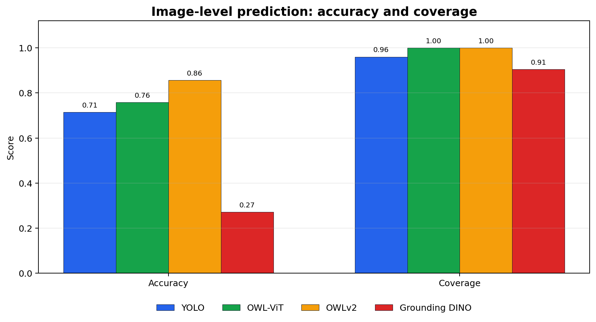
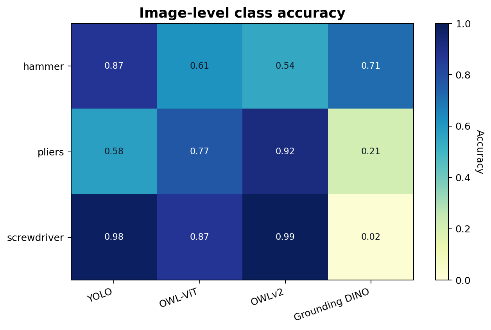
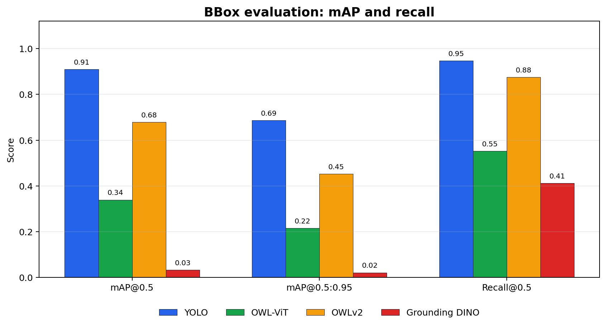
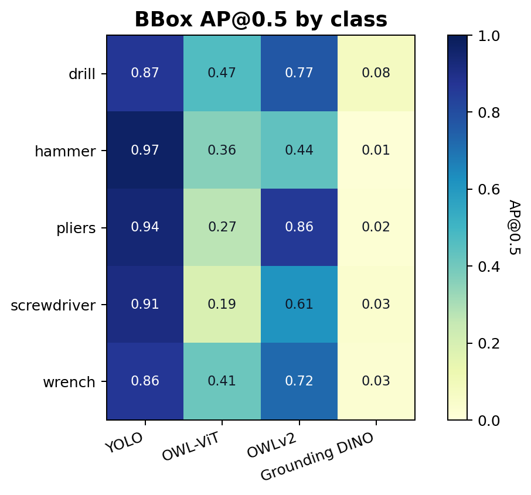
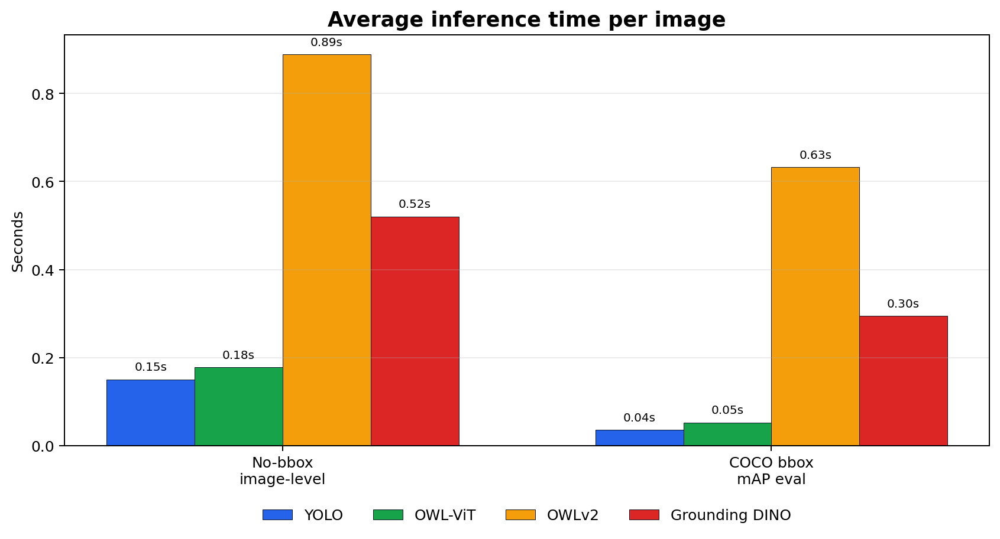
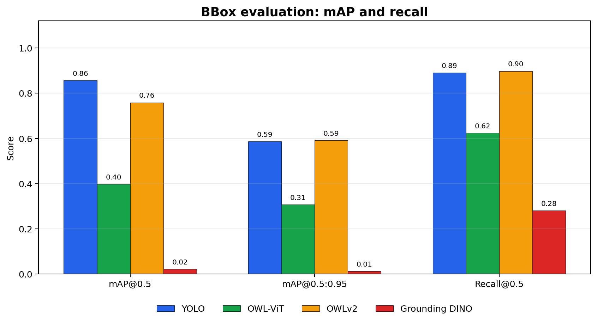
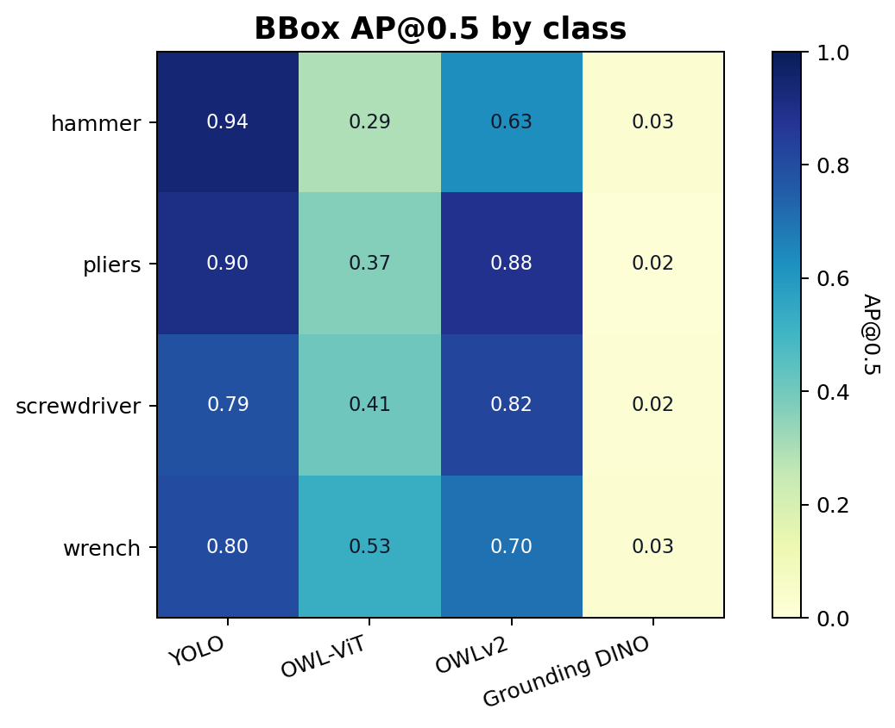
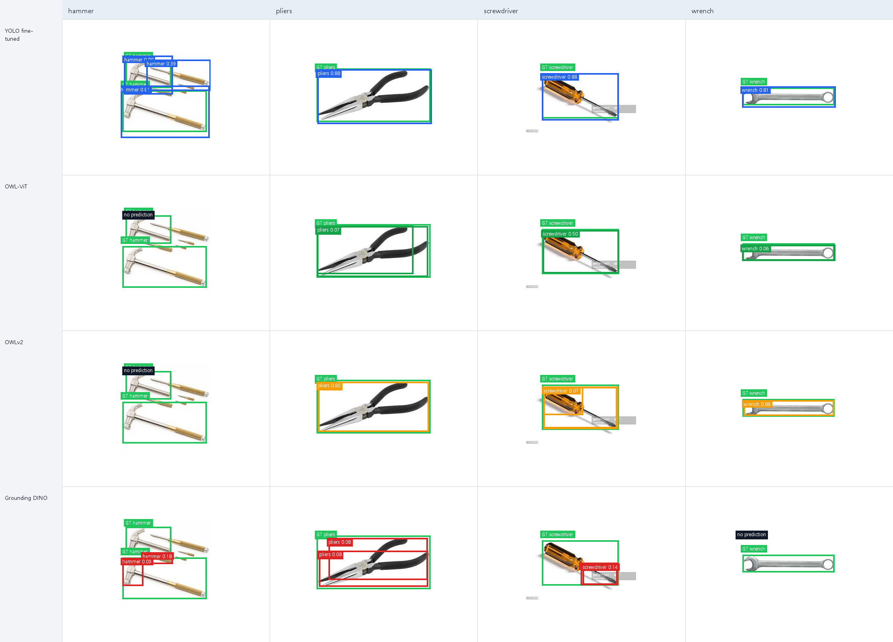

# Foundation 모델과 YOLO Fine-tuning 모델 비교

## 실험 개요

본 과제에서는 fine-tuned YOLO 모델과 여러 Foundation object detection 모델을 두 가지 방식으로 비교하였다.

첫 번째는 bounding box 라벨이 없는 자체 공구 이미지 데이터셋을 사용한 단순 예측 비교이다. 이 경우 객체 위치의 정답이 없기 때문에 폴더명을 image-level ground truth로 사용하고, 모델이 이미지의 주요 객체 class를 맞혔는지 평가하였다.

두 번째는 Roboflow Universe Tools 데이터셋의 COCO bounding box annotation을 사용한 bbox 예측 비교이다. 이 경우 정답 bbox가 있으므로 mAP, Precision, Recall과 같은 object detection 지표를 계산하였다.

## 비교 모델

| 구분 | 모델 |
|---|---|
| Fine-tuned detector | YOLOv11 fine-tuned model |
| Foundation model 1 | OWL-ViT (`google/owlvit-base-patch32`) |
| Foundation model 2 | OWLv2 (`google/owlv2-base-patch16-ensemble`) |
| Foundation model 3 | Grounding DINO (`IDEA-Research/grounding-dino-tiny`) |

YOLO 모델은 `C:\Users\lmhst\Downloads\yolov11_best.pt`를 사용하였다.

---

## 1. BBox 라벨 없는 데이터셋: 단순 예측 비교

### 데이터셋

자체 수집 데이터셋은 `망치`, `드라이버`, `집게류` 폴더로 구성되어 있으며, bounding box annotation은 없다. 따라서 폴더명을 이미지 단위 정답으로 사용하였다.

| Folder | Evaluation class |
|---|---|
| 망치 | hammer |
| 드라이버 | screwdriver |
| 집게류 | pliers |

전체 평가 이미지는 508장이다.

### 평가 방법

각 이미지에 대해 모델이 예측한 detection 중 가장 confidence가 높은 class를 대표 예측으로 사용하였다. 이 대표 class가 폴더명 기반 정답과 일치하면 correct로 계산하였다.

이 실험의 지표는 다음과 같다.

- Accuracy: 대표 예측 class가 정답 class와 일치한 비율
- Detection Coverage: 모델이 하나 이상의 prediction을 생성한 비율
- Avg Time/Image: 이미지당 평균 추론 시간

### 전체 결과

| Model | Correct / Total | Accuracy | Detection Coverage | Avg Time/Image |
|---|---:|---:|---:|---:|
| YOLO fine-tuned | 363 / 508 | 0.715 | 0.961 | 0.150s |
| OWL-ViT | 385 / 508 | 0.758 | 1.000 | 0.178s |
| OWLv2 | 435 / 508 | 0.856 | 1.000 | 0.888s |
| Grounding DINO | 138 / 508 | 0.272 | 0.906 | 0.520s |

위 그래프는 bbox 라벨이 없는 데이터셋에서 모델별 accuracy와 detection coverage를 비교한 것이다. OWLv2는 가장 높은 accuracy를 보였고, OWL 계열 모델은 모든 이미지에서 prediction을 생성하여 coverage가 1.000으로 나타났다.

### 클래스별 Accuracy

| Class | YOLO fine-tuned | OWL-ViT | OWLv2 | Grounding DINO |
|---|---:|---:|---:|---:|
| hammer | 0.871 | 0.614 | 0.545 | 0.713 |
| pliers | 0.575 | 0.768 | 0.915 | 0.209 |
| screwdriver | 0.980 | 0.871 | 0.990 | 0.020 |

클래스별 heatmap을 보면 모델별 강점이 다르게 나타난다. YOLO는 `hammer`와 `screwdriver`에서 강했고, OWLv2는 `pliers`와 `screwdriver`에서 높은 정확도를 보였다.

### 해석

단순 예측 기준에서는 OWLv2가 가장 높은 accuracy를 보였다. 특히 `pliers`에서 OWLv2는 0.915로 YOLO의 0.575보다 높았다. 이는 bbox 라벨이 없고 이미지의 주요 class만 맞히는 조건에서는 Foundation 모델의 open-vocabulary 성능이 유리할 수 있음을 보여준다.

반면 YOLO는 `hammer`와 `screwdriver`에서 높은 정확도를 보였고, 평균 추론 시간도 OWLv2보다 훨씬 짧았다. 따라서 단순 예측 비교에서는 OWLv2가 전체 class matching 성능에서 강했고, YOLO는 속도와 일부 클래스에서 강했다.

단, 이 실험은 bbox 정답이 없기 때문에 객체 위치가 정확한지는 평가하지 못한다.

---

## 2. Roboflow COCO 데이터셋: BBox 예측 비교

### 데이터셋

두 번째 실험에서는 Roboflow Universe Tools 데이터셋의 COCO annotation을 사용하였다. 이 데이터셋에는 bounding box 라벨이 포함되어 있어 object detection 성능을 정식 지표로 평가할 수 있다.

평가에는 YOLO 모델과 클래스가 겹치는 다음 5개 class만 사용하였다.

| Evaluation class |
|---|
| drill |
| hammer |
| pliers |
| screwdriver |
| wrench |

Roboflow annotation의 `Pliers`와 `plier`는 같은 의미로 보고 `pliers`로 통합하였다. 각 클래스별 20장씩 샘플링하여 총 100장의 test subset을 만들었고, ground-truth bbox는 총 192개이다.

### 평가 방법

COCO annotation의 bounding box를 ground truth로 사용하고, 각 모델의 predicted bounding box와 IoU를 계산하였다.

평가 지표는 다음과 같다.

- mAP@0.5: IoU threshold 0.5에서의 mean Average Precision
- mAP@0.5:0.95: IoU threshold 0.5부터 0.95까지 0.05 간격 평균
- Precision@0.5
- Recall@0.5
- Avg Time/Image

### 전체 결과

| Model | mAP@0.5 | mAP@0.5:0.95 | Precision@0.5 | Recall@0.5 | Avg Time/Image |
|---|---:|---:|---:|---:|---:|
| YOLO fine-tuned | 0.910 | 0.686 | 0.176 | 0.948 | 0.036s |
| OWL-ViT | 0.339 | 0.215 | 0.108 | 0.552 | 0.053s |
| OWLv2 | 0.679 | 0.453 | 0.095 | 0.875 | 0.633s |
| Grounding DINO | 0.033 | 0.021 | 0.022 | 0.411 | 0.295s |

bbox 평가 그래프에서는 YOLO fine-tuned 모델이 mAP@0.5, mAP@0.5:0.95, Recall@0.5 모두에서 가장 높은 값을 보인다. 이는 class만 맞히는 수준을 넘어 실제 객체 위치를 찾는 localization 성능에서는 task-specific fine-tuning이 강하다는 것을 보여준다.

### 클래스별 AP@0.5

| Class | YOLO fine-tuned | OWL-ViT | OWLv2 | Grounding DINO |
|---|---:|---:|---:|---:|
| drill | 0.865 | 0.465 | 0.768 | 0.078 |
| hammer | 0.970 | 0.361 | 0.437 | 0.008 |
| pliers | 0.940 | 0.272 | 0.857 | 0.019 |
| screwdriver | 0.913 | 0.188 | 0.612 | 0.033 |
| wrench | 0.864 | 0.411 | 0.722 | 0.026 |

클래스별 AP@0.5 heatmap에서도 YOLO가 모든 평가 클래스에서 안정적으로 높은 AP를 보인다. Foundation 모델 중에서는 OWLv2가 `drill`, `pliers`, `wrench`에서 비교적 강한 성능을 보였다.

### 해석

Bounding box 기준 평가에서는 YOLO fine-tuned 모델이 가장 높은 성능을 보였다. YOLO는 mAP@0.5 0.910, mAP@0.5:0.95 0.686으로 모든 Foundation 모델보다 높았고, 평균 추론 시간도 0.036초로 가장 빨랐다.

Foundation 모델 중에서는 OWLv2가 가장 좋은 bbox 성능을 보였다. OWLv2는 mAP@0.5 0.679, mAP@0.5:0.95 0.453을 기록해 OWL-ViT보다 높았지만, YOLO보다 느리고 localization 성능도 낮았다.

Grounding DINO는 본 실험 설정에서는 낮은 mAP를 보였다. 짧은 class prompt와 공구 데이터셋 조건에서 false positive가 많이 발생한 것이 주요 원인으로 보인다.

Precision@0.5가 전반적으로 낮게 보이는 이유는 AP 계산을 위해 낮은 confidence prediction까지 포함했기 때문이다. 따라서 이 실험에서는 Precision 단독보다 mAP와 Recall을 중심으로 해석하는 것이 적절하다.

---

## 종합 비교

두 실험은 평가 목적이 다르다. bbox 라벨 없는 자체 데이터셋 실험은 모델이 이미지의 주요 객체 class를 맞히는지 확인하는 약식 비교이다. 반면 Roboflow COCO 실험은 실제 bounding box 위치까지 포함한 object detection 평가이다.

추론 시간 비교에서는 YOLO가 bbox 평가 조건에서 가장 빠른 속도를 보였다. OWLv2는 단순 예측과 bbox 평가 모두에서 높은 성능을 보였지만, 다른 모델보다 추론 시간이 긴 편이다.

| 평가 조건 | 가장 좋은 모델 | 주요 해석 |
|---|---|---|
| bbox 없음, image-level class matching | OWLv2 | 라벨이 없고 class만 맞히는 조건에서는 Foundation 모델이 강할 수 있음 |
| bbox 있음, mAP 기반 detection 평가 | YOLO fine-tuned | 위치 정확도와 속도까지 고려하면 fine-tuned detector가 가장 강함 |

결과적으로 Foundation 모델은 라벨이 부족하거나 새로운 class를 빠르게 실험할 때 유용한 baseline으로 사용할 수 있다. 하지만 정확한 bounding box localization과 실시간 추론이 중요한 object detection 과제에서는 task-specific fine-tuning된 YOLO가 더 적합하다.

---

## 3. 독립 AIHub COCO 데이터셋: BBox 재평가

위 Roboflow bbox 평가 데이터셋은 YOLO 학습에 사용된 데이터와 겹칠 가능성이 있어 YOLO에 유리할 수 있다. 이를 보완하기 위해 `aiHub.coco.zip`을 독립 평가셋으로 사용하여 bbox 성능을 다시 비교하였다.

AIHub 데이터셋에는 `drill` 클래스가 없어 제외하고, `hammer`, `pliers`, `screwdriver`, `wrench` 4개 클래스를 평가하였다. 클래스별 최대 40장씩 샘플링하여 최종 157장, ground-truth bbox 295개를 사용하였다.

### AIHub 전체 결과

| Model | mAP@0.5 | mAP@0.5:0.95 | Precision@0.5 | Recall@0.5 | Avg Time/Image |
|---|---:|---:|---:|---:|---:|
| YOLO fine-tuned | 0.857 | 0.587 | 0.380 | 0.892 | 0.030s |
| OWL-ViT | 0.398 | 0.307 | 0.222 | 0.624 | 0.119s |
| OWLv2 | 0.759 | 0.591 | 0.185 | 0.898 | 2.812s |
| Grounding DINO | 0.022 | 0.012 | 0.058 | 0.281 | 0.408s |

독립 AIHub 평가에서도 YOLO는 mAP@0.5와 추론 속도에서 가장 좋았다. 그러나 mAP@0.5:0.95에서는 OWLv2가 0.591로 YOLO의 0.587과 거의 동일했다. 이는 학습 데이터와 겹치지 않는 조건에서는 Foundation 모델의 일반화 성능이 더 강하게 드러날 수 있음을 보여준다.

### AIHub 클래스별 AP@0.5

| Class | YOLO fine-tuned | OWL-ViT | OWLv2 | Grounding DINO |
|---|---:|---:|---:|---:|
| hammer | 0.938 | 0.290 | 0.631 | 0.025 |
| pliers | 0.904 | 0.367 | 0.884 | 0.015 |
| screwdriver | 0.785 | 0.408 | 0.821 | 0.020 |
| wrench | 0.802 | 0.526 | 0.702 | 0.025 |

클래스별로 보면 YOLO는 `hammer`, `pliers`, `wrench`에서 가장 높았고, OWLv2는 `screwdriver`에서 YOLO보다 높은 AP를 보였다.

### 모델별 bbox 예측 예시

아래 그림은 AIHub 독립 평가셋에서 각 클래스별로 랜덤 이미지 1장을 선택하고, 동일 이미지에 대해 모델별 prediction bbox를 시각화한 것이다. 초록색 박스는 ground truth bbox이고, 모델별 색상 박스는 해당 모델의 예측 bbox를 의미한다.

예시에서도 정량 결과와 유사한 경향이 보인다. YOLO는 전반적으로 bbox가 ground truth와 잘 겹치며 confidence도 높게 나타난다. OWLv2는 `pliers`, `wrench`, `screwdriver`에서 비교적 좋은 bbox를 생성하지만 일부 클래스에서는 confidence가 낮거나 객체 일부만 잡는다. Grounding DINO는 false positive나 낮은 confidence prediction이 상대적으로 많이 나타난다.

### Roboflow 평가와 AIHub 평가 비교

| Dataset | Model | mAP@0.5 | mAP@0.5:0.95 | Recall@0.5 |
|---|---|---:|---:|---:|
| Roboflow Tools subset | YOLO fine-tuned | 0.910 | 0.686 | 0.948 |
| Roboflow Tools subset | OWLv2 | 0.679 | 0.453 | 0.875 |
| AIHub subset | YOLO fine-tuned | 0.857 | 0.587 | 0.892 |
| AIHub subset | OWLv2 | 0.759 | 0.591 | 0.898 |

Roboflow 평가에서는 YOLO가 OWLv2보다 큰 차이로 높았지만, AIHub 독립 평가에서는 격차가 크게 줄었다. 특히 mAP@0.5:0.95에서는 OWLv2가 YOLO와 거의 같은 수준이다. 따라서 Roboflow 결과만으로 “YOLO가 압도적으로 우수하다”고 결론내리기보다는, 학습 데이터와 겹치지 않는 독립 데이터셋에서는 Foundation 모델의 일반화 성능도 고려해야 한다.

## 한계

첫 번째 실험은 bbox annotation이 없기 때문에 mAP나 IoU를 계산할 수 없다. 따라서 객체 위치 정확도는 평가하지 못했다.

두 번째 실험은 Roboflow 데이터셋 전체가 아니라 클래스별 20장씩 샘플링한 subset으로 수행하였다. 또한 다운로드된 COCO export가 `train` split 중심이므로 공식 test split과는 다르다. 다만 해당 subset은 본 실험에서 평가용으로만 사용했기 때문에, 모델 간 비교 실험으로는 충분히 의미가 있다.

## 결론

본 실험에서는 bbox 라벨이 없는 경우와 있는 경우를 나누어 YOLO fine-tuned 모델과 여러 Foundation 모델을 비교하였다.

bbox가 없는 단순 예측 비교에서는 OWLv2가 가장 높은 image-level accuracy를 보였다. 하지만 COCO bbox annotation을 사용한 mAP 평가에서는 YOLO fine-tuned 모델이 가장 높은 성능과 가장 빠른 추론 속도를 보였다.

따라서 Foundation 모델은 라벨이 부족한 초기 실험이나 open-vocabulary baseline으로 적합하고, 실제 object detection 성능이 중요한 경우에는 YOLO와 같은 fine-tuned detector가 더 적합하다고 결론낼 수 있다.
